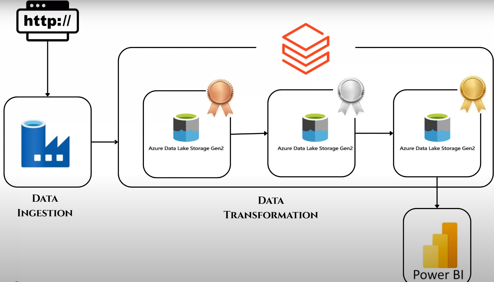

# End-to-End Amazon Sales Data Pipeline on Azure using Medallion Architecture

This project demonstrates a full-scale data engineering pipeline built on Microsoft Azure using the Medallion Architecture pattern. The pipeline ingests Amazon sales data from GitHub, transforms it through multiple curated stages, and visualizes the final insights using Power BI.

---

## 🏗️ Medallion Architecture Overview

The Medallion Architecture is a modern data lake design pattern that organizes data into three layers:

1. **Bronze Layer (Raw)**  
   - Stores unprocessed, raw data as ingested from the source.
   - Ideal for auditing, rollback, and historical reference.

2. **Silver Layer (Cleansed)**  
   - Contains cleaned and structured data.
   - Suitable for analytics and business logic transformation.

3. **Gold Layer (Business)**  
   - Final curated, aggregated, and enriched data ready for reporting.
   - Drives dashboards, ML models, and business decisions.

This layered approach simplifies data governance, increases data quality, and improves performance in large-scale pipelines.

---

## 🚀 Project Overview

The pipeline processes Amazon sales data hosted on GitHub and builds an end-to-end solution for analytical reporting. Using Azure Data Factory, Databricks, and Power BI, the system is designed for scalability, reusability, and modular data transformations.

---

## 📊 Project Architecture

The following diagram illustrates the complete flow of the Amazon Sales Data Pipeline using Medallion Architecture on Azure:

> _This diagram outlines the end-to-end process — from ingestion using Azure Data Factory, through transformation in Azure Databricks across Bronze, Silver, and Gold layers, to final visualization in Power BI._

---

## 🧰 Technology Stack

- **Azure Data Factory (ADF)** – For orchestrating data movement from GitHub to ADLS.
- **Azure Data Lake Storage (ADLS Gen2)** – To store Bronze, Silver, and Gold data layers.
- **Azure Databricks** – For data cleansing, transformation, and business logic.
- **Power BI** – For building dashboards and visual insights.
- **GitHub** – Source of the raw Amazon sales dataset.
- **Delta Lake Format** – For optimized ACID-compliant lakehouse storage.

---

## ⚙️ Step-by-Step Implementation

### 1. **Data Ingestion (Bronze Layer)**

- Load the Amazon sales dataset from GitHub using **Azure Data Factory**.
- Store the ingested raw `.csv` file into the **Bronze** container of Azure Data Lake Storage (ADLS).

### 2. **Data Cleansing & Transformation (Silver Layer)**

- Mount the **Bronze** layer in **Databricks**.
- Use PySpark notebooks to:
  - Remove duplicates.
  - Handle missing/null values.
  - Standardize column formats.
- Save the cleansed output into the **Silver** container in ADLS.

### 3. **Business Logic Transformation (Gold Layer)**

- Read data from the **Silver** layer into Databricks.
- Apply business-related transformations:
  - Aggregations (e.g., total sales, revenue by category).
  - Calculations (e.g., discount, profit margins).
  - Filtering or grouping by country, date, etc.
- Write the final output into the **Gold** container in ADLS.

### 4. **Data Visualization**

- Connect **Power BI** to the **Gold** layer using Azure Data Lake or Synapse connector.
- Create dashboards and reports to display:
  - Total Sales, Revenue, and Orders.
  - Trends over time.
  - Category-wise and regional breakdowns.

---

## ✅ Conclusion

This project showcases an industry-grade Azure-based data pipeline built around the Medallion Architecture. It emphasizes data lake best practices, modular transformation stages, and seamless reporting. This architecture not only ensures traceability and scalability but also keeps the system maintainable for evolving business use cases.
